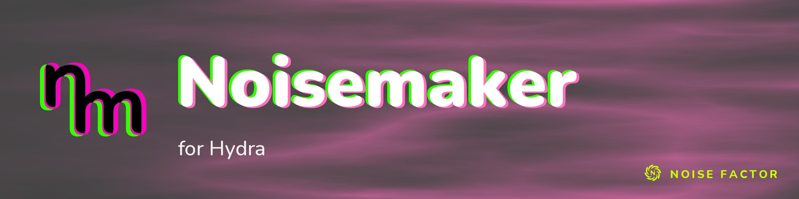

<!-- repo-hero -->
<a href="https://noisemaker.app/"></a>

<sub>Open source from <a href="https://noisefactor.io">Noise Factor</a> &middot; <a href="https://github.com/noisefactorllc">more projects</a></sub>

# Noisemaker for Hydra

Noisemaker for Hydra is an experimental demo fork of the Hydra web editor, allowing mixed native use of Hydra and [Noisemaker](https://noisemaker.app/) in the same programs. The Noisemaker engine takes Hydra from WebGL 1 to 2, adds a WebGPU render target, and mixes in a library of 100+ effects including stateful simulations and particle systems.

To accomplish this, Hydra's renderer and editor were surgically swapped out, and Hydra's built-in effects were ported to Noisemaker definition format. Noisemaker programs are written in Polymorphic DSL, a similar but more verbose live coding dialect.

This is intended to be an interesting short-lived tech demo only, illustrating how Noisemaker can be dropped in to other projects.

## Run locally

```sh
npm install
npm run dev
```

Open <http://localhost:5173/>.

## A Hydra sketch using Polymorphic DSL

```text
search hydra, render

noise(scale: 5)
  .write(o0)

render(o0)
```

## Chain Hydra's noise to complex effects from Noisemaker

```text
search hydra, points, render

noise(scale: 5)
  .pointsEmit()
  .flow()
  .pointsRender()
  .write(o0)

render(o0)
```

## Verify

```sh
npm run build
npm test
```

The test suite covers editor evaluation, Noisemaker AST mutation, renderer lifecycle, removal of legacy execution paths, and browser compilation of default and URL-encoded sketches.

## Engine bundle

The browser loads the companion engine bundle from `public/_engine/hydra-synth.js`. The historical bundle filename is retained as an internal runtime path; the repository and package are named `noisemaker-for-hydra` and `noisemaker-for-hydra-synth`.

## Upstream

This fork is based on the [Hydra web editor](https://github.com/hydra-synth/hydra) and retains its AGPL license and attribution history.
